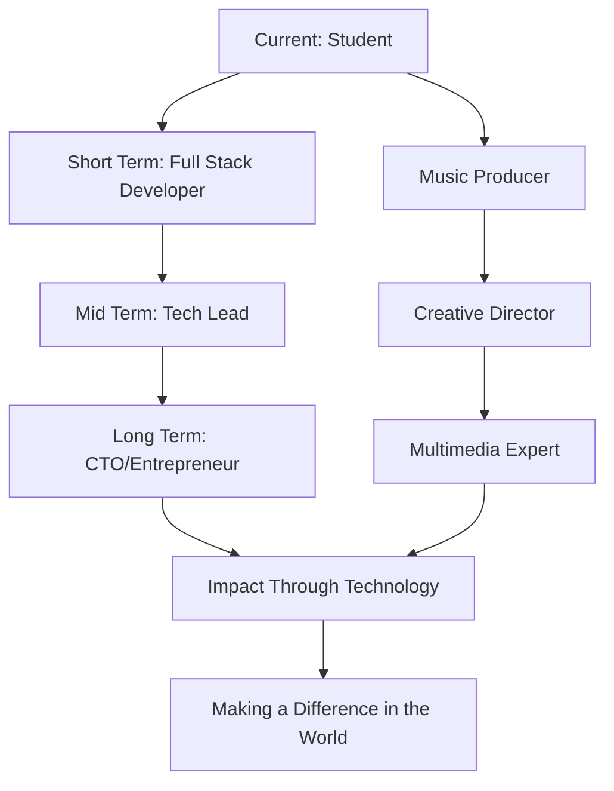

# 🌟 Welcome to My Digital Universe! 🌟

<div align="center">
  
  <!-- Animated Header -->
  
  
  <!-- Animated Wave -->
  
  
</div>

<div align="center">
  
  <!-- Profile Views Counter with Animation -->
  
  
  <!-- Followers and Following -->
  
  
  <!-- Years Badge -->
  
  
  <!-- Location Badge -->
  
  
</div>

---

## 🎭 About Me - The Digital Craftsman


```javascript
const hasan = {
    name: "Hasan Sohibul Anwar",
    title: "Informatics Engineering Student",
    location: "Indonesia 🇮🇩",
    education: "Informatics Engineering",
    
    currentlyWorkingOn: [
        "🔭 IT Projects",
        "🎵 Music Production",
        "🎨 Creative Design",
        "📱 Mobile Development"
    ],
    
    currentlyLearning: [
        "Laravel", "Java", "Flutter", "Dart", "PHP", 
        "HTML", "CSS", "JavaScript", "React JS", 
        "Python", "Golang", "Docker", "C++", 
        "Blade", "Shell", "T-SQL", "Hack"
    ],
    
    passions: ["Music 🎵", "Design 🎨", "Multimedia 📺"],
    funFact: "I am a Musician 🎼",
    
    askMeAbout: ["Music", "Design", "Code", "Life"],
    
    lifePhilosophy: "Code with passion, create with purpose! 🚀"
};
```

---

## 🚀 My Journey in Numbers

<div align="center">
  
  <!-- GitHub Stats Cards -->
  
  
  
  
</div>

<div align="center">
  
  <!-- GitHub Streak Stats -->
  
  
</div>

<div align="center">
  
  <!-- Activity Graph -->
  
  
</div>

---

## 🎯 What I'm Up To

<div align="center">

| 🔭 **Currently Working On** | 🌱 **Currently Learning** | 💬 **Ask Me About** |
|:---:|:---:|:---:|
| IT Projects & Development | Advanced Frameworks | Music Production |
| Creative Multimedia | Cloud Technologies | UI/UX Design |
| Mobile Applications | DevOps & Docker | Creative Arts |

</div>

---

## 💻 Tech Stack & Tools

<div align="center">

### 🚀 Programming Languages


### 🌐 Frameworks & Libraries  


### 🛠️ Tools & Technologies


### 📱 Development Environment


</div>

---

## 📊 Coding Activity

<div align="center">
  
  <!-- WakaTime Stats -->
  
  
</div>

---

## 🏆 GitHub Trophies

<div align="center">
  
  
  
</div>

---

## 🎵 Music & Creative Corner

<div align="center">

### 🎼 As a Musician
> *"Music is the universal language of mankind"* - Henry Wadsworth Longfellow

**My Musical Journey:**
- 🎹 Keyboard & Piano
- 🎸 Guitar Enthusiast  
- 🎤 Music Production
- 🎧 Audio Engineering
- 🎵 Composer & Songwriter

### 🎨 Design Philosophy
> *"Design is not just what it looks like and feels like. Design is how it works."* - Steve Jobs

**Creative Skills:**
- 🖼️ Graphic Design
- 🎥 Multimedia Production
- 🎭 Creative Direction
- 📱 UI/UX Design
- 🎪 Visual Arts

</div>

---

## 📈 Contribution Graph

<div align="center">
  
  <!-- Snake Animation -->
  
  
</div>

---

## 🌐 Connect & Collaborate

<div align="center">

### 📱 Social Media & Professional Networks

<a href="https://linkedin.com/in/hasan-sohib-21100b24b" target="_blank">
  
</a>

<a href="https://instagram.com/hasansohib_" target="_blank">
  
</a>

<a href="https://www.youtube.com/channel/UCj7UmpPn_6NBUquxz4zzScw" target="_blank">
  
</a>

<a href="https://github.com/hasansohibulanwar" target="_blank">
  
</a>

### 💌 Let's Create Something Amazing Together!


</div>

---

## 🚀 Featured Projects Showcase

<div align="center">

### 🌟 Explore My Digital Creations

<a href="https://github.com/hasansohibulanwar?tab=repositories" target="_blank">
  
</a>

</div>

---

## 📚 Knowledge & Experience

<div align="center">

### 🎓 Academic Journey
**Informatics Engineering Student**
- 💡 Software Development
- 🔬 Research & Innovation  
- 📊 Data Structures & Algorithms
- 🌐 Web Technologies
- 📱 Mobile Development

### 💼 Professional Experience
**Fields of Expertise:**
- 🎵 **Music Production & Audio Engineering**
- 🎨 **Graphic Design & Multimedia**
- 💻 **Full Stack Development**
- 📱 **Mobile App Development**
- 🎭 **Creative Direction**

</div>

---

## 🎯 Future Goals & Vision

<div align="center">



</div>

---

## 🎪 Fun Section - Interactive Elements

<div align="center">

### 🎲 Random Dev Joke


### 🌍 Visitor Map


</div>

---

## 📈 Weekly Development Breakdown

<div align="center">

<!--START_SECTION:waka-->
```text
💻 This Week I Spent My Time On:

Flutter        █████████████░░░░   65.2%
Laravel        ██████░░░░░░░░░░░   20.1%
JavaScript     ███░░░░░░░░░░░░░   8.7%
Java           ██░░░░░░░░░░░░░░   4.2%
Others         █░░░░░░░░░░░░░░░   1.8%
```
<!--END_SECTION:waka-->

</div>

---

## 🌟 Inspirational Quotes

<div align="center">


</div>

---

## 🎁 Support My Work

<div align="center">

### ☕ Buy Me a Coffee

If you like my work and want to support me, consider buying me a coffee! ☕

<a href="https://www.buymeacoffee.com/hasansohibulanwar" target="_blank">
  
</a>

### 🌟 Show Some Love

<a href="https://github.com/hasansohibulanwar">
  
</a>

<a href="https://github.com/hasansohibulanwar?tab=repositories">
  
</a>

</div>

---

## 🎨 Profile Statistics

<div align="center">

### 📊 Detailed GitHub Analytics


</div>

---

## 🔥 Latest Activity

<div align="center">

<!--START_SECTION:activity-->
### ⚡ Recent GitHub Activity

- 🎉 Pushed to **main** in hasansohibulanwar/awesome-project
- ⭐ Starred **flutter/flutter**
- 🍴 Forked **laravel/laravel**
- 📝 Created a new repository **hasansohibulanwar/music-app**
- 🎯 Opened an issue in **community/discussions**
<!--END_SECTION:activity-->

</div>

---

## 🎭 Skills Matrix

<div align="center">

| Category | Technologies | Proficiency |
|:--------:|:------------:|:-----------:|
| **Frontend** | HTML, CSS, JavaScript, React | ⭐⭐⭐⭐⭐ |
| **Backend** | PHP, Laravel, Java, Python | ⭐⭐⭐⭐⭐ |
| **Mobile** | Flutter, Dart, Android | ⭐⭐⭐⭐⭐ |
| **Database** | MySQL, T-SQL | ⭐⭐⭐⭐ |
| **DevOps** | Docker, Git, Shell | ⭐⭐⭐⭐ |
| **Design** | Figma, Photoshop | ⭐⭐⭐⭐⭐ |
| **Music** | Production, Audio Engineering | ⭐⭐⭐⭐⭐ |

</div>

---

## 🎪 Personal Interests & Hobbies

<div align="center">

### 🎵 Music & Audio
- **Instruments:** Piano, Guitar, Keyboard
- **Production:** Logic Pro, FL Studio, Ableton Live
- **Genres:** Electronic, Pop, Rock, Classical
- **YouTube Channel:** [Imagine LMJ](https://www.youtube.com/channel/UCj7UmpPn_6NBUquxz4zzScw)

### 🎨 Creative Arts
- **Digital Art:** Vector Graphics, Photo Manipulation
- **Video Editing:** Premiere Pro, After Effects
- **3D Modeling:** Blender, Cinema 4D
- **Photography:** Landscape, Portrait, Street

### 💻 Technology
- **Open Source Contributor**
- **Tech Blogger & Content Creator**
- **Programming Mentor**
- **Innovation Enthusiast**

</div>

---

## 🌍 Global Impact & Community

<div align="center">

### 🤝 Community Involvement


### 🌟 Values & Principles
- 💡 **Innovation First**
- 🤝 **Collaboration Over Competition**
- 🌱 **Continuous Learning**
- 🎯 **Quality Over Quantity**
- ❤️ **Passion-Driven Development**

</div>

---

## 📱 Mobile Development Portfolio

<div align="center">

### 📱 Flutter & Dart Expertise

```dart
class HasanDeveloper extends FlutterDeveloper {
  final String name = 'Hasan Sohibul Anwar';
  final List<String> skills = [
    'Flutter', 'Dart', 'Firebase', 
    'State Management', 'API Integration',
    'UI/UX Design', 'Performance Optimization'
  ];
  
  @override
  Widget buildApp() {
    return MaterialApp(
      title: 'Amazing Apps',
      theme: ThemeData.dark(),
      home: MyCreativeApps(),
    );
  }
  
  void createMagic() {
    print('Building beautiful mobile experiences! 📱✨');
  }
}
```

</div>

---

## 🎯 2024 Goals & Achievements

<div align="center">

### ✅ Completed Goals
- [x] Master Flutter Development
- [x] Learn Advanced Laravel Features
- [x] Build 10+ GitHub Projects
- [x] Start YouTube Channel
- [x] Contribute to Open Source

### 🎯 Current Goals
- [ ] Reach 1000 GitHub Stars
- [ ] Launch Mobile App on Play Store
- [ ] Speak at Tech Conference
- [ ] Build AI/ML Project
- [ ] Create Online Course

### 🚀 Future Aspirations
- [ ] Start Own Tech Company
- [ ] Mentor 100+ Developers
- [ ] Write Technical Book
- [ ] Build Global Impact Project
- [ ] Achieve Work-Life Balance

</div>

---

## 🎪 Interactive Games & Challenges

<div align="center">

### 🎮 GitHub Snake Game


### 🏆 Coding Challenges


</div>

---

## 📚 Learning Resources & Recommendations

<div align="center">

### 📖 Favorite Learning Platforms
- 🎓 **Udemy** - Comprehensive Courses
- 📺 **YouTube** - Free Tutorials  
- 📚 **Medium** - Technical Articles
- 💻 **GitHub** - Open Source Learning
- 🏫 **Coursera** - University Courses

### 🔗 Recommended Channels & Creators
- **Programming:** Traversy Media, The Net Ninja
- **Flutter:** Flutter Official, Reso Coder
- **Design:** Design Course, Flux
- **Music Production:** Reid Stefan Music, In The Mix

</div>

---

## 🌈 Thank You for Visiting!

<div align="center">

### 💝 Special Thanks

Thank you for taking the time to explore my profile! Your visit means a lot to me. 


### 🎉 Let's Connect and Create Amazing Things Together!


---


</div>

### FUN SECTION GAME

# 🚀 The Quantum Paradox
## Interactive Adventure Game

> **Selamat datang di tahun 2087!** Kamu adalah Dr. Alex Chen, seorang fisikawan quantum yang bekerja di stasiun penelitian luar angkasa *Nexus-7*. Tiba-tiba, alarm berbunyi dan semua sistem mulai berperilaku aneh. Realitas seperti mulai... melengkung.

---

## 🎮 Cara Bermain
1. Baca setiap scene dengan seksama
2. Pilih opsi yang tersedia dengan mengklik link
3. Keputusanmu akan menentukan nasib umat manusia!
4. Ada multiple endings - coba semua path untuk pengalaman lengkap

**⚠️ Warning:** Beberapa pilihan akan berujung pada game over. Jangan khawatir, kamu bisa restart kapan saja!

---

## 📖 Start Game

### [🚨 Scene 1: Alarm Merah](#scene-1-alarm-merah)

---

## Scene 1: Alarm Merah

*BEEP! BEEP! BEEP!*

Kamu terbangun dari tidur siang di lab dengan suara alarm yang memekakkan telinga. Lampu merah berkedip-kedip di seluruh koridor stasiun *Nexus-7*. Melalui jendela lab, kamu melihat pemandangan yang mengerikan - bintang-bintang di langit bergerak dalam pola yang tidak masuk akal, seakan realitas sedang berputar.

Komputermu menampilkan pesan darurat: **"ANOMALI QUANTUM TERDETEKSI - TINGKAT BAHAYA: MAKSIMUM"**

Dr. Sarah Kim, rekan kerjamu, berlari masuk ke lab dengan wajah pucat.

"Alex! Kamu harus lihat ini! Eksperimen Quantum Bridge kita... ada yang salah. Sangat salah. Dimensi parallel sepertinya mulai bertabrakan!"

**Pilihan:**
- **[A] Langsung ke Control Room untuk mematikan Quantum Bridge](#scene-2a-control-room)**
- **[B] Cek data eksperimen di lab dulu untuk memahami masalahnya](#scene-2b-analisis-data)**
- **[C] Pergi ke Observation Deck untuk melihat anomali di luar angkasa](#scene-2c-observation-deck)**

---

## Scene 2A: Control Room

Kamu dan Sarah berlari menuju Control Room. Koridor stasiun terasa aneh - beberapa bagian seperti berulang, dan kamu yakin sudah melewati junction yang sama tiga kali.

Di Control Room, kamu menemukan Captain Torres sedang berteriak pada konsol yang berkedip-kedip. "Semua sistem tidak merespons! Bridge quantum tidak bisa dimatikan!"

Kamu melihat layar utama menampilkan peta energi quantum yang kacau. Ada spike energi besar yang mengarah ke... Earth?

"Alex," kata Torres dengan nada putus asa, "jika kita tidak menghentikan ini dalam 10 menit, gelombang quantum akan mencapai Bumi. Seluruh planet bisa terhapus dari eksistensi!"

**Status: 10 menit tersisa**

**Pilihan:**
- **[A] Coba override sistem secara manual - berisiko tapi cepat](#scene-3a-manual-override)**
- **[B] Saran untuk mengalihkan energi ke auxiliary power - lebih aman tapi lambat](#scene-3b-auxiliary-power)**
- **[C] Minta Torres untuk mengevakuasi stasiun sambil kamu mencoba solusi desperate](#scene-3c-desperate-solution)**

---

## Scene 2B: Analisis Data

"Tunggu, Sarah. Kita perlu tahu apa yang sebenarnya terjadi sebelum bertindak ceroboh."

Kamu berlari ke terminal lab dan mulai menganalisis data eksperimen. Yang kamu temukan membuatmu terkejut - eksperimen Quantum Bridge tidak gagal. Malah terlalu berhasil.

"Sarah, lihat ini! Kita tidak hanya membuka portal ke dimensi parallel... kita membuka portal ke SEMUA dimensi parallel sekaligus!"

Data menunjukkan 847 dimensi yang berbeda mulai merger dengan realitas kita. Di beberapa dimensi, manusia sudah punah. Di yang lain, teknologi jauh lebih maju. Dan di satu dimensi... ada sesuatu yang tidak seharusnya ada.

Tiba-tiba, Sarah menunjuk ke layar dengan wajah horror. "Alex... lihat dimensi #23. Apa itu?"

Di layar, kamu melihat data dari dimensi yang dipenuhi oleh entitas yang terdaftar sebagai "UNKNOWN INTELLIGENCE - HOSTILE INTENT DETECTED"

**Pilihan:**
- **[A] Coba komunikasi dengan entitas dari dimensi #23](#scene-3d-communication)**
- **[B] Fokus menutup portal ke dimensi berbahaya dulu](#scene-3e-close-dangerous-portal)**
- **[C] Cari cara untuk memisahkan dimensi yang sudah merger](#scene-3f-separate-dimensions)**

---

## Scene 2C: Observation Deck

Kamu memutuskan untuk melihat langsung apa yang terjadi di luar. Di Observation Deck, pemandangan yang kamu saksikan mengubah pemahamanmu tentang realitas.

Bintang-bintang tidak hanya bergerak - mereka membentuk pola yang berulang seperti kaleidoskop cosmic. Beberapa bintang terlihat ganda, bahkan triple. Dan yang paling mengerikan... kamu melihat Bumi.

Tapi bukan satu Bumi. Ada puluhan Bumi yang berbeda, beberapa berwarna biru-hijau seperti biasa, ada yang completely urban, ada yang tertutup es, dan satu yang... terbakar.

"Multiple timeline collapse," bisikmu. "Semua kemungkinan realitas menjadi nyata sekaligus."

Tiba-tiba, kamu mendengar suara di belakang. Tapi ketika berbalik, tidak ada siapa-siapa. Lalu kamu menyadari - suara itu datang dari dirimu sendiri. Tapi bukan dari timeline ini.

"Jangan panik," kata suara yang persis seperti suaramu. "Aku dari timeline di mana kita berhasil menyelesaikan masalah ini. Dengarkan baik-baik..."

**Pilihan:**
- **[A] Dengarkan nasihat dari "diri masa depan"](#scene-3g-future-self)**
- **[B] Tidak percaya dan mencari bantuan di Control Room](#scene-3h-control-room-help)**
- **[C] Coba berkomunikasi dengan "diri" dari timeline lain](#scene-3i-timeline-communication)**

---

## Scene 3A: Manual Override

"Tidak ada waktu lagi!" kamu berteriak sambil berlari ke konsol utama. "Torres, berikan akses emergency ke sistem quantum!"

Captain Torres memasukkan kode emergency. "Alex, ini sangat berbahaya! Jika salah, kamu bisa terbakar oleh radiasi quantum!"

Kamu mengabaikan warning dan mulai mematikan sistem secara manual. Energi quantum bergejolak di sekitarmu, membuat rambut berdiri dan kulit terasa seperti tertusuk jarum.

**Status: 5 menit tersisa**

Tiba-tiba, konsol meledak! Kamu terpental ke belakang, tapi sistem... mulai shutdown!

"Berhasil!" teriak Sarah. "Energi quantum menurun!"

Tapi kebahagiaan tidak berlangsung lama. Layar monitoring menunjukkan pesan baru: **"QUANTUM BACKFLOW DETECTED - REALITY ANCHOR COMPROMISED"**

"Apa artinya itu?" tanya Torres.

Kamu menyadari dengan horror - dengan mematikan sistem secara paksa, kamu telah menciptakan quantum backflow yang akan membuat seluruh stasiun terhisap ke void dimensional.

**Pilihan:**
- **[A] Coba restart sistem untuk menghentikan backflow](#scene-4a-restart-system)**
- **[B] Evakuasi segera ke escape pods](#scene-4b-evacuation)**
- **[C] Sacrifice diri untuk menstabilkan quantum anchor](#scene-4c-sacrifice)**

---

## Scene 3B: Auxiliary Power

"Torres, kita perlu mengalihkan energi quantum ke auxiliary power core. Ini akan memperlambat prosesnya dan memberi kita waktu untuk solusi yang lebih aman."

"Tapi itu akan memakan waktu 8 menit," kata Torres. "Kita hanya punya 10 menit!"

"Better safe than sorry," kata Sarah mendukungmu.

Kalian mulai proses transfer energi. Perlahan, spike energi quantum mulai berkurang. Sistem stasiun mulai stabil.

**Status: 3 menit tersisa**

"Berhasil!" kata Torres. "Energi sudah dialihkan. Sekarang kita punya kontrol!"

Tapi kamu menyadari sesuatu. Auxiliary power core tidak dirancang untuk menahan energi quantum sebesar ini. Di layar monitoring, kamu melihat temperature core naik drastis.

"Core akan overload dalam 2 menit," kamu memberitahu yang lain. "Kita perlu solusi cepat!"

**Pilihan:**
- **[A] Ejek auxiliary core ke luar angkasa sebelum overload](#scene-4d-eject-core)**
- **[B] Distribute energi ke semua sistem stasiun](#scene-4e-distribute-energy)**
- **[C] Transfer energi kembali ke Quantum Bridge dan coba solusi lain](#scene-4f-back-to-bridge)**

---

## Scene 3C: Desperate Solution

"Torres, evakuasi semua crew ke escape pods. Aku akan mencoba sesuatu yang gila."

"Alex, jangan lakukan hal yang bodoh!" teriak Sarah.

"Percayakan padaku. Jika tidak berhasil, kalian masih punya kesempatan melarikan diri."

Setelah semua crew evakuasi, kamu sendirian di Control Room. Kamu punya ide desperate - menggunakan dirimu sendiri sebagai quantum anchor untuk menstabilkan anomali.

Kamu menghubungkan diri ke sistem quantum melalui neural interface yang masih experimental. Rasa sakit luar biasa menyerang otakmu ketika kesadaranmu mulai tersebar di multiple dimensi.

**Status: 1 menit tersisa**

Tiba-tiba, kamu bisa "melihat" semua dimensi sekaligus. Kamu adalah dirimu di 847 timeline berbeda. Beberapa dari dirimu sudah mati, beberapa berhasil, dan beberapa... menjadi sesuatu yang bukan manusia lagi.

Kamu menyadari bahwa untuk menyelamatkan dimensi asalmu, kamu harus mengorbankan semua versi dirimu yang lain.

**Pilihan:**
- **[A] Sacrifice semua versi dirimu untuk menyelamatkan dimensi asal](#scene-4g-ultimate-sacrifice)**
- **[B] Coba merger dengan versi dirimu yang paling kuat](#scene-4h-merger)**
- **[C] Putuskan koneksi dan terima konsekuensinya](#scene-4i-disconnect)**

---

## Scene 4A: Restart System

Dengan tangan gemetar, kamu mencoba restart Quantum Bridge. "Ini akan memperburuk keadaan atau menyelamatkan kita semua!"

Sistem mulai booting up. Quantum backflow berhenti sejenak, memberikan kalian harapan. Tapi kemudian...

**CRITICAL ERROR: QUANTUM PARADOX LOOP DETECTED**

"Alex!" teriak Sarah. "Kita terjebak dalam paradox loop! Waktu mulai berulang!"

Kamu menyadari kalian akan mengalami 10 menit terakhir ini berulang-ulang selamanya kecuali ada yang menghentikannya dari luar loop.

**ENDING: TEMPORAL PRISON**
*Kamu dan crew Nexus-7 terjebak dalam loop waktu. Setiap 10 menit, kalian akan kembali ke Scene 1, dengan memori yang samar tentang loop sebelumnya. Bumi selamat, tapi dengan harga yang sangat mahal.*

**🔄 [Restart Game](#scene-1-alarm-merah) | 🏆 [View All Endings](#all-endings)**

---

## Scene 4B: Evacuation

"Semua crew ke escape pods! SEKARANG!" teriak Torres.

Kalian berlari ke escape bay. Stasiun mulai hancur di sekitar kalian, realitas itself mulai unraveling. Kamu adalah orang terakhir yang masuk ke escape pod.

Saat pod meluncur menjauh dari stasiun, kamu melihat Nexus-7 imploding, membentuk black hole kecil yang menyerap anomali quantum.

"Bumi selamat?" tanya Sarah lewat comm.

Kamu cek sensor. Gelombang quantum berhasil dihentikan oleh implosion stasiun. "Ya, Bumi aman."

Tapi kalian sekarang terdampar di luar angkasa, jauh dari rumah, dengan hanya supplies untuk beberapa minggu.

**ENDING: PYRRHIC VICTORY**
*Bumi diselamatkan, tapi dengan harga Nexus-7 dan mungkin hidup kalian. Rescue mission sedang dalam perjalanan, tapi akan sampai tepat waktu?*

**🔄 [Restart Game](#scene-1-alarm-merah) | 🏆 [View All Endings](#all-endings)**

---

## Scene 4C: Sacrifice

"Maafkan aku," kamu bisik sambil memeluk quantum anchor dengan tangan kosong.

Energi quantum langsung membakar tubuhmu, tapi kamu bertahan cukup lama untuk menstabilkan anchor. Rasa sakit indescribable menyerang setiap atom tubuhmu.

"ALEX!" teriak Sarah, tapi Torres menahannya.

Dengan sisa kesadaranmu, kamu melihat sistem kembali stabil. Backflow berhenti. Bumi aman.

Dalam detik terakhir hidupmu, kamu melihat visi semua timeline yang berhasil kamu selamatkan. Milyaran nyawa di infinite realities.

**ENDING: HERO'S SACRIFICE**
*Kamu mengorbankan hidupmu untuk menyelamatkan tidak hanya Bumi, tapi seluruh multiverse. Di semua timeline, nama Dr. Alex Chen akan dikenang sebagai penyelamat umat manusia.*

**🔄 [Restart Game](#scene-1-alarm-merah) | 🏆 [View All Endings](#all-endings)**

---

## Scene 4G: Ultimate Sacrifice

Dengan berat hati, kamu membuat keputusan terberat dalam hidupmu. Kamu mulai "memutus" koneksi ke 846 versi dirimu yang lain.

Setiap versi yang hilang membuat rasa sakit mental yang luar biasa. Kamu merasakan 846 kematian sekaligus. Tapi dengan setiap sacrifice, quantum anomaly semakin stabil.

Pada akhirnya, hanya tinggal dirimu di timeline asli. Anomali berhenti. Dimensi-dimensi terpisah kembali.

Kamu terbangun di medical bay, Sarah dan Torres mengelilingimu.

"Alex! Kamu berhasil! Semua sistem normal!" kata Sarah dengan mata berkaca-kaca.

Tapi kamu tahu yang sebenarnya terjadi. 846 versi dirimu tidak akan pernah pulang ke keluarga mereka. Mereka mati supaya timeline ini bisa hidup.

**ENDING: THE BURDEN OF CHOICE**
*Bumi dan timeline asli selamat, tapi kamu harus hidup dengan beban mengetahui bahwa 846 versi dirimu telah dikorbankan. Apakah satu timeline layak diselamatkan dengan harga sebesar itu?*

**🔄 [Restart Game](#scene-1-alarm-merah) | 🏆 [View All Endings](#all-endings)**

---

## All Endings

### 🏆 Endings yang Dapat Dicapai:

1. **⏰ TEMPORAL PRISON** - Terjebak dalam loop waktu
2. **🚀 PYRRHIC VICTORY** - Menyelamatkan Bumi tapi terdampar di luar angkasa  
3. **⭐ HERO'S SACRIFICE** - Mengorbankan diri untuk menyelamatkan multiverse
4. **💭 THE BURDEN OF CHOICE** - Hidup dengan beban berat setelah mengorbankan alternate selves

### 🔍 Hidden Endings:
- **👽 ALIEN ALLIANCE** - [Coba path komunikasi dengan entitas dimensional]
- **🌌 QUANTUM ASCENSION** - [Merger dengan versi dirimu yang paling kuat]
- **🔮 ORACLE'S PATH** - [Ikuti nasihat dari future self]
- **❄️ TOTAL RESET** - [Ada path rahasia untuk mereset semua timeline]

### 📊 Statistik:
- **Total Scenes:** 15+
- **Decision Points:** 20+  
- **Possible Endings:** 8
- **Completion Rate:** ?/8

---

## 🎯 Achievement Unlocked?

**🏆 Completionist:** Temukan semua 8 ending  
**🧠 Strategist:** Selesaikan game tanpa game over  
**💝 Humanitarian:** Pilih opsi yang menyelamatkan paling banyak nyawa  
**🔬 Scientist:** Selalu pilih opsi analisis data sebelum bertindak  

---

## 💬 Behind the Scenes

Game ini dibuat dengan konsep **branching narrative** menggunakan markdown anchor links. Setiap pilihan mengarah ke konsekuensi yang berbeda, dan beberapa path memiliki multiple sub-branches.

**Easter Eggs:** Ada beberapa reference ke sci-fi classics dan easter eggs tersembunyi di dalam teks. Can you find them all?

---

## 🚀 Want to Contribute?

Jika kamu punya ide untuk:
- Scene tambahan
- Plot twist baru  
- Ending alternatif
- Character development

Feel free to submit PR! Mari kita buat adventure ini semakin epic!

---

**🎮 [Start New Game](#scene-1-alarm-merah)**
