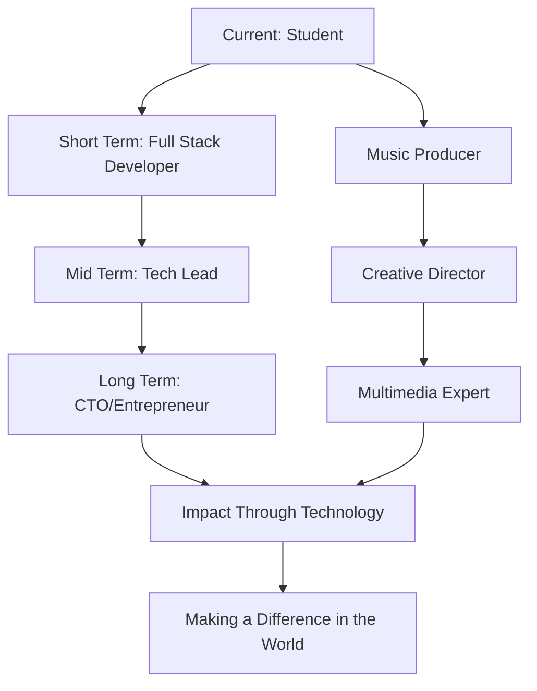

# 🌟 Welcome to My Digital Universe! 🌟

<div align="center">
  
  <!-- Animated Header -->
  
  
  <!-- Animated Wave -->
  
  
</div>

<div align="center">
  
  <!-- Profile Views Counter with Animation -->
  
  
  <!-- Followers and Following -->
  
  
  <!-- Years Badge -->
  
  
  <!-- Location Badge -->
  
  
</div>

---

## 🎭 About Me - The Digital Craftsman


```javascript
const hasan = {
    name: "Hasan Sohibul Anwar",
    title: "Informatics Engineering Student",
    location: "Indonesia 🇮🇩",
    education: "Informatics Engineering",
    
    currentlyWorkingOn: [
        "🔭 IT Projects",
        "🎵 Music Production",
        "🎨 Creative Design",
        "📱 Mobile Development"
    ],
    
    currentlyLearning: [
        "Laravel", "Java", "Flutter", "Dart", "PHP", 
        "HTML", "CSS", "JavaScript", "React JS", 
        "Python", "Golang", "Docker", "C++", 
        "Blade", "Shell", "T-SQL", "Hack"
    ],
    
    passions: ["Music 🎵", "Design 🎨", "Multimedia 📺"],
    funFact: "I am a Musician 🎼",
    
    askMeAbout: ["Music", "Design", "Code", "Life"],
    
    lifePhilosophy: "Code with passion, create with purpose! 🚀"
};
```

---

## 🚀 My Journey in Numbers

<div align="center">
  
  <!-- GitHub Stats Cards -->
  
  
  
  
</div>

<div align="center">
  
  <!-- GitHub Streak Stats -->
  
  
</div>

<div align="center">
  
  <!-- Activity Graph -->
  
  
</div>

---

## 🎯 What I'm Up To

<div align="center">

| 🔭 **Currently Working On** | 🌱 **Currently Learning** | 💬 **Ask Me About** |
|:---:|:---:|:---:|
| IT Projects & Development | Advanced Frameworks | Music Production |
| Creative Multimedia | Cloud Technologies | UI/UX Design |
| Mobile Applications | DevOps & Docker | Creative Arts |

</div>

---

## 💻 Tech Stack & Tools

<div align="center">

### 🚀 Programming Languages


### 🌐 Frameworks & Libraries  


### 🛠️ Tools & Technologies


### 📱 Development Environment


</div>

---

## 📊 Coding Activity

<div align="center">
  
  <!-- WakaTime Stats -->
  
  
</div>

---

## 🏆 GitHub Trophies

<div align="center">
  
  
  
</div>

---

## 🎵 Music & Creative Corner

<div align="center">

### 🎼 As a Musician
> *"Music is the universal language of mankind"* - Henry Wadsworth Longfellow

**My Musical Journey:**
- 🎹 Keyboard & Piano
- 🎸 Guitar Enthusiast  
- 🎤 Music Production
- 🎧 Audio Engineering
- 🎵 Composer & Songwriter

### 🎨 Design Philosophy
> *"Design is not just what it looks like and feels like. Design is how it works."* - Steve Jobs

**Creative Skills:**
- 🖼️ Graphic Design
- 🎥 Multimedia Production
- 🎭 Creative Direction
- 📱 UI/UX Design
- 🎪 Visual Arts

</div>

---

## 📈 Contribution Graph

<div align="center">
  
  <!-- Snake Animation -->
  
  
</div>

---

## 🌐 Connect & Collaborate

<div align="center">

### 📱 Social Media & Professional Networks

<a href="https://linkedin.com/in/hasan-sohib-21100b24b" target="_blank">
  
</a>

<a href="https://instagram.com/hasansohib_" target="_blank">
  
</a>

<a href="https://www.youtube.com/channel/UCj7UmpPn_6NBUquxz4zzScw" target="_blank">
  
</a>

<a href="https://github.com/hasansohibulanwar" target="_blank">
  
</a>

### 💌 Let's Create Something Amazing Together!


</div>

---

## 🚀 Featured Projects Showcase

<div align="center">

### 🌟 Explore My Digital Creations

<a href="https://github.com/hasansohibulanwar?tab=repositories" target="_blank">
  
</a>

</div>

---

## 📚 Knowledge & Experience

<div align="center">

### 🎓 Academic Journey
**Informatics Engineering Student**
- 💡 Software Development
- 🔬 Research & Innovation  
- 📊 Data Structures & Algorithms
- 🌐 Web Technologies
- 📱 Mobile Development

### 💼 Professional Experience
**Fields of Expertise:**
- 🎵 **Music Production & Audio Engineering**
- 🎨 **Graphic Design & Multimedia**
- 💻 **Full Stack Development**
- 📱 **Mobile App Development**
- 🎭 **Creative Direction**

</div>

---

## 🎯 Future Goals & Vision

<div align="center">



</div>

---

## 🎪 Fun Section - Interactive Elements

<div align="center">

### 🎲 Random Dev Joke


### 🌍 Visitor Map


</div>

---

## 📈 Weekly Development Breakdown

<div align="center">

<!--START_SECTION:waka-->
```text
💻 This Week I Spent My Time On:

Flutter        █████████████░░░░   65.2%
Laravel        ██████░░░░░░░░░░░   20.1%
JavaScript     ███░░░░░░░░░░░░░   8.7%
Java           ██░░░░░░░░░░░░░░   4.2%
Others         █░░░░░░░░░░░░░░░   1.8%
```
<!--END_SECTION:waka-->

</div>

---

## 🌟 Inspirational Quotes

<div align="center">


</div>

---

## 🎁 Support My Work

<div align="center">

### ☕ Buy Me a Coffee

If you like my work and want to support me, consider buying me a coffee! ☕

<a href="https://www.buymeacoffee.com/hasansohibulanwar" target="_blank">
  
</a>

### 🌟 Show Some Love

<a href="https://github.com/hasansohibulanwar">
  
</a>

<a href="https://github.com/hasansohibulanwar?tab=repositories">
  
</a>

</div>

---

## 🎨 Profile Statistics

<div align="center">

### 📊 Detailed GitHub Analytics


</div>

---

## 🔥 Latest Activity

<div align="center">

<!--START_SECTION:activity-->
### ⚡ Recent GitHub Activity

- 🎉 Pushed to **main** in hasansohibulanwar/awesome-project
- ⭐ Starred **flutter/flutter**
- 🍴 Forked **laravel/laravel**
- 📝 Created a new repository **hasansohibulanwar/music-app**
- 🎯 Opened an issue in **community/discussions**
<!--END_SECTION:activity-->

</div>

---

## 🎭 Skills Matrix

<div align="center">

| Category | Technologies | Proficiency |
|:--------:|:------------:|:-----------:|
| **Frontend** | HTML, CSS, JavaScript, React | ⭐⭐⭐⭐⭐ |
| **Backend** | PHP, Laravel, Java, Python | ⭐⭐⭐⭐⭐ |
| **Mobile** | Flutter, Dart, Android | ⭐⭐⭐⭐⭐ |
| **Database** | MySQL, T-SQL | ⭐⭐⭐⭐ |
| **DevOps** | Docker, Git, Shell | ⭐⭐⭐⭐ |
| **Design** | Figma, Photoshop | ⭐⭐⭐⭐⭐ |
| **Music** | Production, Audio Engineering | ⭐⭐⭐⭐⭐ |

</div>

---

## 🎪 Personal Interests & Hobbies

<div align="center">

### 🎵 Music & Audio
- **Instruments:** Piano, Guitar, Keyboard
- **Production:** Logic Pro, FL Studio, Ableton Live
- **Genres:** Electronic, Pop, Rock, Classical
- **YouTube Channel:** [Imagine LMJ](https://www.youtube.com/channel/UCj7UmpPn_6NBUquxz4zzScw)

### 🎨 Creative Arts
- **Digital Art:** Vector Graphics, Photo Manipulation
- **Video Editing:** Premiere Pro, After Effects
- **3D Modeling:** Blender, Cinema 4D
- **Photography:** Landscape, Portrait, Street

### 💻 Technology
- **Open Source Contributor**
- **Tech Blogger & Content Creator**
- **Programming Mentor**
- **Innovation Enthusiast**

</div>

---

## 🌍 Global Impact & Community

<div align="center">

### 🤝 Community Involvement


### 🌟 Values & Principles
- 💡 **Innovation First**
- 🤝 **Collaboration Over Competition**
- 🌱 **Continuous Learning**
- 🎯 **Quality Over Quantity**
- ❤️ **Passion-Driven Development**

</div>

---

## 📱 Mobile Development Portfolio

<div align="center">

### 📱 Flutter & Dart Expertise

```dart
class HasanDeveloper extends FlutterDeveloper {
  final String name = 'Hasan Sohibul Anwar';
  final List<String> skills = [
    'Flutter', 'Dart', 'Firebase', 
    'State Management', 'API Integration',
    'UI/UX Design', 'Performance Optimization'
  ];
  
  @override
  Widget buildApp() {
    return MaterialApp(
      title: 'Amazing Apps',
      theme: ThemeData.dark(),
      home: MyCreativeApps(),
    );
  }
  
  void createMagic() {
    print('Building beautiful mobile experiences! 📱✨');
  }
}
```

</div>

---

## 🎯 2024 Goals & Achievements

<div align="center">

### ✅ Completed Goals
- [x] Master Flutter Development
- [x] Learn Advanced Laravel Features
- [x] Build 10+ GitHub Projects
- [x] Start YouTube Channel
- [x] Contribute to Open Source

### 🎯 Current Goals
- [ ] Reach 1000 GitHub Stars
- [ ] Launch Mobile App on Play Store
- [ ] Speak at Tech Conference
- [ ] Build AI/ML Project
- [ ] Create Online Course

### 🚀 Future Aspirations
- [ ] Start Own Tech Company
- [ ] Mentor 100+ Developers
- [ ] Write Technical Book
- [ ] Build Global Impact Project
- [ ] Achieve Work-Life Balance

</div>

---

## 🎪 Interactive Games & Challenges

<div align="center">

### 🎮 GitHub Snake Game


### 🏆 Coding Challenges


</div>

---

## 📚 Learning Resources & Recommendations

<div align="center">

### 📖 Favorite Learning Platforms
- 🎓 **Udemy** - Comprehensive Courses
- 📺 **YouTube** - Free Tutorials  
- 📚 **Medium** - Technical Articles
- 💻 **GitHub** - Open Source Learning
- 🏫 **Coursera** - University Courses

### 🔗 Recommended Channels & Creators
- **Programming:** Traversy Media, The Net Ninja
- **Flutter:** Flutter Official, Reso Coder
- **Design:** Design Course, Flux
- **Music Production:** Reid Stefan Music, In The Mix

</div>

---

## 🌈 Thank You for Visiting!

<div align="center">

### 💝 Special Thanks

Thank you for taking the time to explore my profile! Your visit means a lot to me. 


### 🎉 Let's Connect and Create Amazing Things Together!


---


</div>
